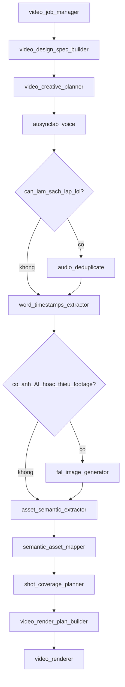
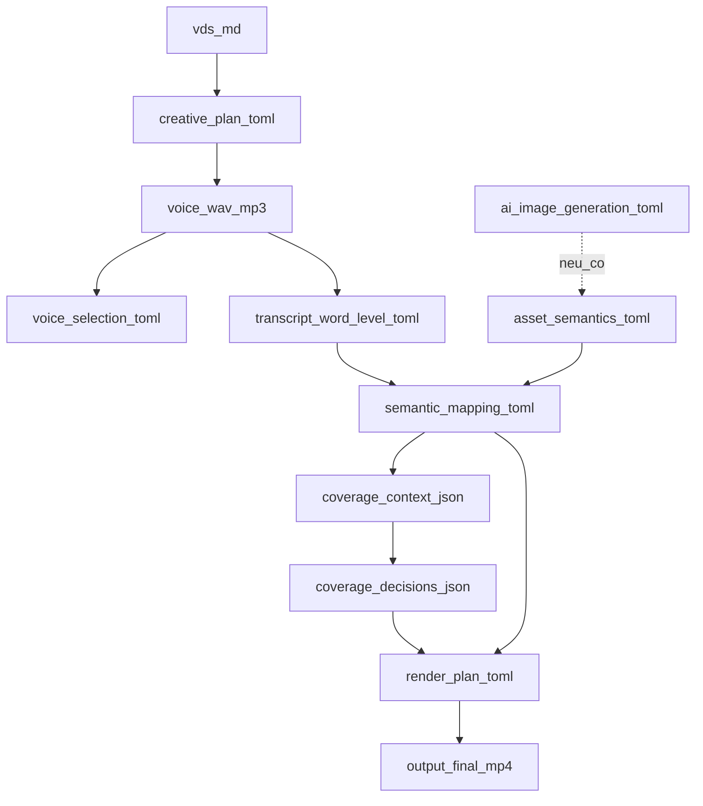
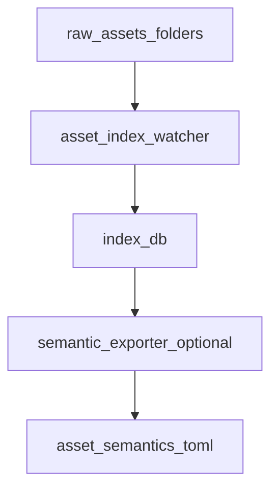

Trang này giải thích bức tranh lớn của VAS bằng ngôn ngữ đơn giản.

Bạn có thể hình dung VAS như một pipeline (dây chuyền) làm video. Mỗi video là một **job** riêng trong thư mục `jobs/<job_id>/`. Mỗi bước của dây chuyền làm một việc cụ thể, ghi kết quả vào `source/`, rồi bước tiếp theo đọc kết quả đó để làm tiếp.

Nếu gặp từ lạ, xem thêm [Thuật ngữ](/glossary). Skill `$video-production-orchestrator` là người điều phối thứ tự chạy các bước bên dưới.

## Pipeline làm video

Mục đích sơ đồ: trả lời câu hỏi “VAS làm gì trước, làm gì sau để tạo ra một video hoàn chỉnh?”.

**Cách đọc sơ đồ:** Luồng bắt đầu bằng việc tạo job, lấy hoặc dựng định hướng hình ảnh, rồi viết kế hoạch video. Sau đó VAS tạo voice, tách voice thành transcript có timestamp, chọn asset phù hợp cho từng đoạn, kiểm tra có đủ hình không, tạo render plan, rồi xuất file MP4.

- Hình thoi là điểm quyết định. Job chỉ đi vào nhánh đó khi cần.
- `audio_deduplicate` chỉ chạy khi voice bị lặp lời và cần làm sạch.
- `fal_image_generator` chỉ chạy khi video cần ảnh AI hoặc không có đủ footage.
- Các bước cuối cùng luôn là chọn asset, kiểm tra coverage, tạo render plan và render video.

## File trung gian trong một job

Mục đích sơ đồ: trả lời câu hỏi “mỗi bước tạo ra file gì, và file đó được dùng để làm gì tiếp theo?”.

**Cách đọc sơ đồ:** Mỗi ô là một file hoặc kết quả quan trọng trong job. `creative_plan.toml` nói video cần kể chuyện gì. Voice audio là phần lời đọc. Transcript cho biết từng câu, từng từ xuất hiện lúc nào. `asset_semantics.toml` mô tả nội dung của ảnh, video, audio trong raw asset. Từ các file đó, VAS tạo mapping, quyết định cách bù footage thiếu, rồi tạo `render_plan.toml` để renderer xuất video cuối.

- `asset_semantics.toml` trả lời câu hỏi “trong các asset này có gì?”.
- `semantic_mapping.toml` trả lời câu hỏi “đoạn nào trong video nên dùng asset nào?”.
- `coverage_decisions.json` trả lời câu hỏi “nếu thiếu hình, nên giữ khung, kéo chậm, dùng cutaway hay Ken Burns?”.
- `render_plan.toml` là bản hướng dẫn cuối cùng để renderer dựng MP4.

## Asset index chạy nền

Mục đích sơ đồ: trả lời câu hỏi “VAS nhớ nội dung raw asset như thế nào để không phải phân tích lại từ đầu mỗi lần làm video?”.

**Cách đọc sơ đồ:** `asset_index` là kho nhớ nội dung asset của repo. Khi bạn thêm file vào `raw_assets/`, watcher phát hiện file mới và cập nhật `.asset_index/index.db`. Khi một job cần dùng asset, exporter đọc DB này để tạo `asset_semantics.toml` cho riêng job đó.

Nhờ vậy, một asset đã được phân tích có thể dùng lại cho nhiều job. VAS không cần gửi cùng một file đi phân tích lại nếu nội dung file không đổi.

## Bước tiếp theo

<Columns cols={2}>
  <Card title="Thuật ngữ" icon="book" href="/glossary">
    Định nghĩa VAS, job, VDS, EDL, stale…
  </Card>
  <Card title="Tổng quan Skills" icon="cubes" href="/skills/index">
    Danh sách skill và cách gọi `$skill-name`.
  </Card>
  <Card title="Tính năng" icon="sparkles" href="/features">
    Nhóm tính năng và tích hợp IDE.
  </Card>
  <Card title="Orchestrator" icon="diagram-project" href="/skills/video-production-orchestrator">
    Hợp đồng artifact đầy đủ trong skill điều phối.
  </Card>
</Columns>
