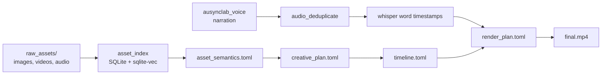

**VAS** (viết tắt của [`video-automator-skills`](https://github.com/bachdyon/video-automator-skills)) là kho kỹ năng (skills) để xây pipeline sản xuất video ngắn bằng agent: lập kế hoạch, xử lý audio, ánh xạ asset, dựng timeline và render. Mỗi skill đóng gói một bước trong pipeline, có thể tái sử dụng giữa các job.

<Note>
  Tài liệu này áp dụng cho repo [`bachdyon/video-automator-skills`](https://github.com/bachdyon/video-automator-skills). Mọi thuật ngữ kỹ thuật (`watcher`, `embedding`, `pipeline`…) giữ nguyên tiếng Anh; nội dung hướng dẫn viết bằng tiếng Việt.
</Note>

## Pipeline tổng quan

## Bắt đầu

<Columns cols={2}>
  <Card title="Cài đặt nhanh" icon="rocket" href="/quickstart">
    Double-click installer cho macOS hoặc Windows — xong trong < 5 phút.
  </Card>
  <Card title="Cài đặt đầy đủ" icon="screwdriver-wrench" href="/installation/macos">
    Cài full deps cho 3 OS để dùng toàn bộ pipeline (Remotion render, voice TTS).
  </Card>
  <Card title="Skills" icon="cubes" href="/skills/audio-deduplicate">
    Danh sách skills tái sử dụng được, kèm hướng dẫn dùng.
  </Card>
  <Card title="Asset Index" icon="database" href="/asset-index/architecture">
    Module index ngầm — watcher tự phân tích asset bằng Gemini + OpenAI embedding.
  </Card>
</Columns>

## Khái niệm cốt lõi

<Columns cols={2}>
  <Card title="Skill" icon="puzzle-piece">
    Một module tái sử dụng (`skills/<name>/SKILL.md`) đóng gói 1 bước pipeline. Agent đọc `SKILL.md` để biết cách dùng.
  </Card>
  <Card title="Job" icon="folder-tree">
    Một lần chạy pipeline thực tế — input + artifact + output trong `jobs/<job_id>/`.
  </Card>
  <Card title="Asset Index" icon="magnifying-glass">
    Watcher chạy nền theo dõi `raw_assets/`, embed nội dung vào SQLite vector DB.
  </Card>
  <Card title="Render plan" icon="film">
    File TOML mô tả EDL (edit decision list) — input cho Remotion / FFmpeg renderer.
  </Card>
</Columns>

## Cần giúp đỡ?

<Card title="Khắc phục sự cố" icon="wrench" href="/troubleshooting">
  Danh sách lỗi thường gặp và cách xử lý nhanh.
</Card>
