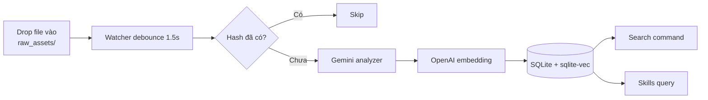

Sau khi cài đặt xong, có 4 use case người mới hay làm:

<Columns cols={2}>
  <Card title="Index asset" icon="upload" href="#index-asset">
    Thả file vào `raw_assets/` — watcher tự phân tích và lưu vào DB.
  </Card>
  <Card title="Tìm asset" icon="magnifying-glass" href="/usage/search">
    Truy vấn tiếng Việt qua `Search.command` hoặc CLI.
  </Card>
  <Card title="Kiểm tra trạng thái" icon="heart-pulse" href="/usage/status">
    Xem watcher pid, processed_count, last_error.
  </Card>
  <Card title="Verify sau cài" icon="check-double" href="/usage/verify">
    Test sạch để chắc chắn pipeline hoạt động.
  </Card>
</Columns>

## Index asset

Drop file vào một trong 3 folder:

- `raw_assets/images/` — JPG, PNG, WEBP, GIF…
- `raw_assets/videos/` — MP4, MOV, MKV, WEBM…
- `raw_assets/audio/` — WAV, MP3, M4A, FLAC…

Watcher debounce 1.5s rồi:

1. Hash file (SHA-256) — nếu đã có trong DB, skip.
2. Gửi qua analyzer phù hợp (Gemini Vision cho image/video, Gemini multimodal cho audio).
3. Embed mô tả qua OpenAI `text-embedding-3-small` (1536 chiều).
4. Lưu vào `.asset_index/index.db`.

<Tip>
  Mỗi file chỉ tốn LLM call **1 lần duy nhất**. File đổi tên hoặc di chuyển không tốn thêm vì hash không đổi.
</Tip>

## Workflow tổng quan

## Bước tiếp theo

Đọc lần lượt:

1. [Tìm asset](/usage/search) — chi tiết Search.command + CLI search.
2. [Kiểm tra trạng thái](/usage/status) — đọc state.json + service status.
3. [Verify sau cài](/usage/verify) — test sạch.
